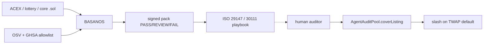

<!-- aicom-mirror-notice -->
> **📖 Read-only mirror.** `basanos` is published from the canonical AI-Factory monorepo.
> **Pull requests are not accepted** — any commit pushed here is overwritten by
> `scripts/mirror_satellites.sh` on the next sync.
> 🐞 Found a bug or have a request? Please **[open an issue](https://github.com/alexar76/basanos/issues)**.

# BASANOS

<!-- aicom-readme-badges -->
<p align="center">
  <a href="https://github.com/alexar76/basanos/actions/workflows/ci.yml"></a>
  <a href="https://github.com/alexar76/basanos/actions/workflows/pages.yml"></a>
  =3.11" />
  
  
  
  <a href="https://github.com/alexar76/basanos/blob/main/LICENSE"></a>
</p>
<!-- /aicom-readme-badges -->

<p align="center">
  <strong>BASANOS</strong> (βάσανος) — the Lydian <strong>touchstone</strong> for ecosystem Solidity<br>
  Signed assurance pack at a pinned commit · not insurance · not a red team · not Hub admission
</p>

<p align="center">
  <a href="README.md"><b>English</b></a> ·
  <a href="docs/README.ru.md">Русский</a> ·
  <a href="docs/README.es.md">Español</a> ·
  <a href="docs/README.fr.md">Français</a> ·
  <a href="docs/README.zh.md">中文</a>
</p>

**Capability:** `agent.security.contract-assurance@v1` · **Port:** `9470` ·
**Live:** [basanos.modelmarket.dev](https://basanos.modelmarket.dev) (oracle host, port `9470` behind nginx) ·
**Landing:** [alexar76.github.io/basanos](https://alexar76.github.io/basanos/) ·
**HEPHAESTUS landing:** [forge.modelmarket.dev](https://forge.modelmarket.dev/) (Hub host — not this node)

`forge.modelmarket.dev` is **HEPHAESTUS** (the smith). This node is the stone you scrape the alloy on.

## Layers (do not collapse them)

| Node | Question | Layer |
|---|---|---|
| **HEPHAESTUS** | Compose and price a capability chain? | Studio at [modelmarket.dev/studio](https://modelmarket.dev/studio) · landing [forge.modelmarket.dev](https://forge.modelmarket.dev/) |
| **THEMIS** | Let this agent into the Hub catalogue? | Procurement admission |
| **MOMUS** | Is the live federation holey? | Runtime red team |
| **BASANOS** | Is this Solidity sound at commit X? | Technical assurance pack |
| **AgentAuditPool** | Who staked USDC, and what `scoreBps` did they publish? | On-chain insurance |

Assurance packs inform coverage decisions; AgentAuditPool enforces economic consequences.
BASANOS never emits `scoreBps` and never calls `coverListing`.

On FAIL / REVIEW the pack includes a **recommend-only** playbook (ISO/IEC 29147 disclosure,
ISO/IEC 30111 handling, NIST SP 800-61 containment): stop shipping that digest, verify
privately, patch, re-scan, disclose after the fix or a 90-day CVD window. It will not pause
a live contract or publish an exploit.



## Two layers of analysis

| Layer | Sees | Example it catches |
|---|---|---|
| **Per file** (17 detectors) | one contract at a time — CEI, access modifiers, entropy, delegatecall, raw `ecrecover`, spot-price reads, an allow-list that is written but never enforced | `mapping(address => bool) marketMakers` with a setter and no reader — a door with a lock and no latch |
| **Whole tree** (`basanos/xcontract.py`) | a contract graph: per-contract state, who may write each slot (following storage pointers and one level of internal calls), and which contract reads which other contract's state | one balance mutated under two different `onlyX` gates while a third contract lends against it; a value read as a price that any caller may define |

The second layer exists because of a measurement worth repeating. A hand audit of this
ecosystem's own **ACEX** contracts found two exploitable criticals — the same USDC pledged
to a lending pool *and* to a bond series across two contracts, and a default whose
beneficiary could trigger it. A full BASANOS scan of that exact tree returned **eight
findings, all `pragma.floating`**, and the pack read **PASS**. Both bugs were correct in
every single file; only the graph was wrong. The same tree now reads **FAIL** with the root
causes named, and the fixed tree reads **REVIEW** — never a silent PASS on a shape nobody
has checked.

What the graph layer does **not** do is prove the invariant. It tells you which invariant
to check and where the two ends of it are. `basanos/limits.py` states this on every pack.

## Quick start

```bash
cd basanos
uv sync --extra dev
uv run pytest -q
uv run python agent.py   # http://127.0.0.1:9470/ui/
```

```bash
# `fixtures` is BASANOS's own deliberately-vulnerable corpus and always resolves, so this
# works on a fresh clone. It should come back FAIL with real findings.
curl -sS http://127.0.0.1:9470/invoke \
  -H 'content-type: application/json' \
  -d '{"product_id":"basanos","capability_id":"agent.security.contract-assurance@v1","input":{"roots":["fixtures"]}}'
```

### Which roots you can ask for

A caller names a **root id**, never a path — that is what stops `/invoke` from becoming a
local-file read primitive.

| id | Resolves to | Available in a standalone clone |
|---|---|---|
| `fixtures`, `sound` | BASANOS's own test corpus | **yes** |
| `acex`, `lottery`, `core`, `zk` | the aicom monorepo's contract trees | only inside that monorepo |

To scan your own tree, point `BASANOS_CONTRACT_ROOT` at a checkout laid out the way the id
expects (`acex` → `acex/contracts/evm/src`, and so on).

### The four verdicts

`PASS` · `REVIEW` · `FAIL` — and `NO_SUBJECT`, which means **no Solidity was read**, so the
pack judges nothing. It is not a clean bill and not an accusation: asking for `acex` from a
standalone clone gets you this, not a FAIL about code BASANOS never opened.


Intel (optional, off by default): `BASANOS_THREAT_INTEL=1` — fetches only `api.osv.dev` and
`api.github.com`. Advisory text reorders detectors. It cannot add a detector.

Scan **memos** (Metis-style local memory) persist hits per contract kind, distill lessons after
repeated findings, and boost that family on the next scan. They never emit `scoreBps`.

## Deploy

| Surface | Host | Script |
|---|---|---|
| BASANOS live node | oracle (same box as MOMUS) | `sudo ./scripts/deploy_basanos.sh` |
| HEPHAESTUS landing | Hub (`modelmarket.dev`) | `./scripts/deploy_forge_landing.sh --remote root@<hub>` |

Both scripts live in the **aicom monorepo**, not in this repository — this satellite is a
mirror of `aicom/basanos`, and the deploy tooling stays with the fleet that owns the hosts.

DNS: `basanos` → oracle. `forge` → Hub. Neither belongs on hunt.

## What it is not

- Not Slither, not a $80k firm PDF, not Foundry `forge test`
- Not a prover: the graph layer finds the SHAPE of a cross-contract flaw and says which
  invariant to verify — it does not verify it, and it does not price the payoff
- Not HEPHAESTUS, not MOMUS, not THEMIS, not AgentAuditPool
